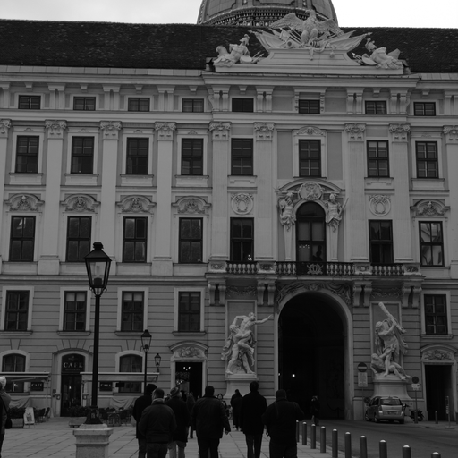
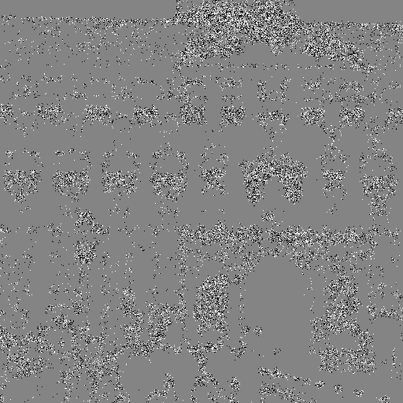

# Результаты моделей для стегоанализа изображений

## Результаты модели ViT на алгоритмах S-UNIWARD, WOW, HUGO

| **Модель\Алгоритмы**             | [WOW](https://dde.binghamton.edu/download/stego_algorithms/download/WOW_windows_vc_2010_v10.zip) | [HUGO](https://dde.binghamton.edu/download/stego_algorithms/download/HUGO_bounding_windows_vc_2010_v10.zip) | [S-UNIWARD](https://dde.binghamton.edu/download/stego_algorithms/download/S-UNIWARD_windows_vc_2010_v10.zip) |
|----------------------------------|--------------------------------------------------------------------------------------------------|-------------------------------------------------------------------------------------------------------------|--------------------------------------------------------------------------------------------------------------|
| Stego ViT                        | *85.8%*                                                                                          | *89.8%*                                                                                                     | *88.3%*                                                                                                      |
| Stego CNN With Spatial Attention | None                                                                                             | *78%*                                                                                                       | *73.7%*                                                                                                      |

## Архитектура моделей

### ViT

### CNN With Spatial Attention

## Гиперпараметры

## Стеганографические алгоритмы

| **Алгоритмы**                                          | [**S-UNIWARD**](./stego_algs_exes/S-UNIWARD.exe)                | [**WOW**](./stego_algs_exes/WOW.exe)           | [**HUGO**](./stego_algs_exes/HUGO)               |
|--------------------------------------------------------|-----------------------------------------------------------------|------------------------------------------------|--------------------------------------------------|
|  |  |  |  |

## Dataset

| **Datasets**                                                                                          |
|-------------------------------------------------------------------------------------------------------|
| [**BossBase 1.01**](https://dde.binghamton.edu/download/ImageDB/BOSSbase_1.01.zip) cropped to 256x256 |
| [**ImageNet 256×256**](https://www.kaggle.com/datasets/dimensi0n/imagenet-256)                        |

## [Ресурс с алгоритмами](https://dde.binghamton.edu/download/)

